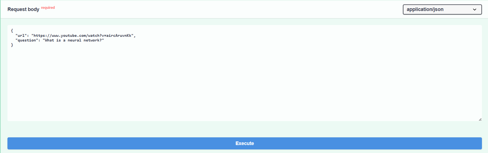
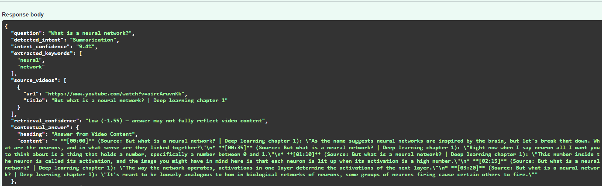
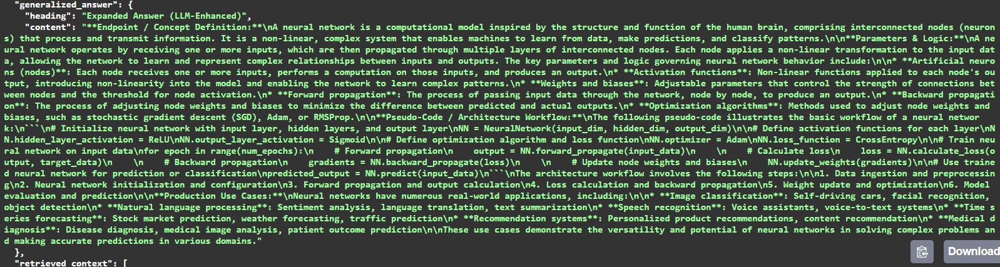
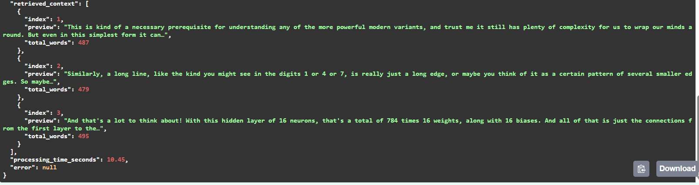
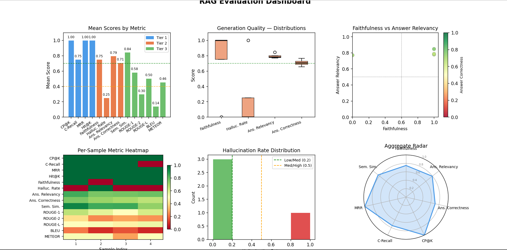
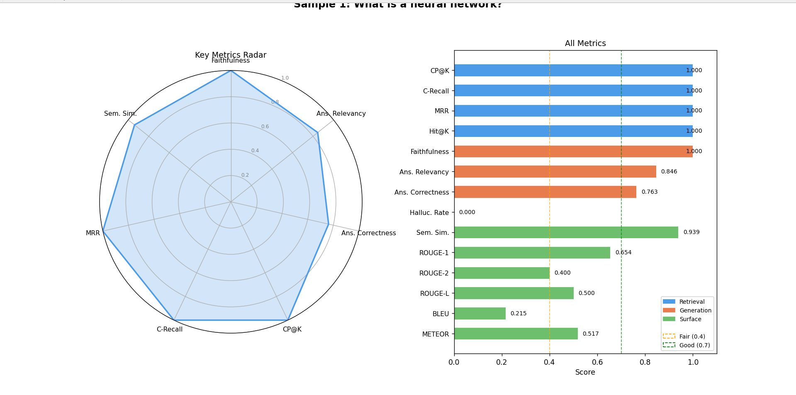
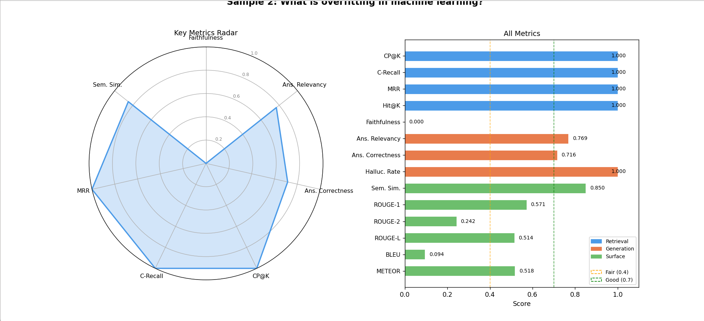
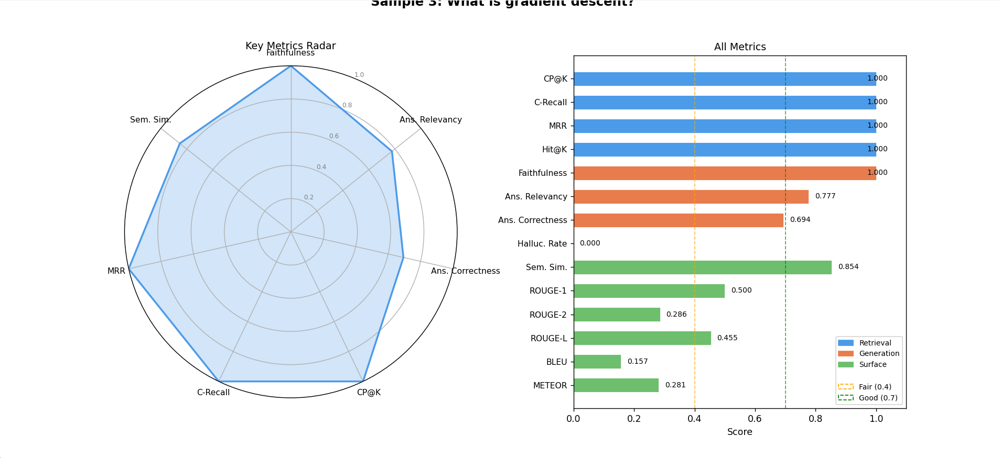
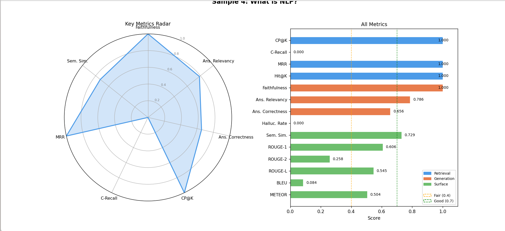

# 📺 YouTube RAG QA System

> Real-time question answering from YouTube videos using Retrieval-Augmented Generation, hybrid search, and cross-encoder reranking.


---

## Table of Contents

1. [Overview](#1-overview)
2. [Key Features](#2-key-features)
3. [How It Works](#3-how-it-works)
4. [Dataset & Preprocessing](#4-dataset--preprocessing)
5. [Model Architecture](#5-model-architecture)
6. [Tech Stack](#6-tech-stack)
7. [Folder Structure](#7-folder-structure)
8. [How to Run](#8-how-to-run)
9. [API Endpoints](#9-api-endpoints)
10. [Sample Output](#10-sample-output)
11. [Evaluation Metrics](#11-evaluation-metrics)
12. [Future Improvements](#12-future-improvements)
13. [References](#13-references)
14. [Contributors](#14-contributors)

---

## 1. Overview

**YouTube RAG QA System** is a production-ready AI backend that answers natural language questions from YouTube video transcripts using a full **Retrieval-Augmented Generation (RAG)** pipeline.

The system automatically extracts transcripts from any YouTube video, semantically retrieves the most relevant segments, reranks them with a cross-encoder, and generates two answer types via the Gemini API — a **contextual answer** grounded strictly in video content, and a **generalised answer** that combines retrieved evidence with broader knowledge.

Designed for students, researchers, and enterprise knowledge management, the system closes the gap between the world's largest video library and structured, citable, semantically grounded QA.

---

## 2. Key Features

- 🎥 **Multi-video QA** — query 1–3 YouTube URLs simultaneously with cross-source evidence synthesis
- 🧠 **Semantic intent detection** — 7-class query classification using Sentence-BERT (no keyword rules)
- 🔍 **Hybrid retrieval** — FAISS (dense) + BM25 (sparse) fused via Reciprocal Rank Fusion
- 🔄 **Two-pass iterative retrieval** — second search using TF-IDF keywords from the top result
- 🏆 **Cross-encoder reranking** — joint (query, chunk) scoring via `ms-marco-MiniLM-L-6-v2`
- 📐 **MMR diversity selection** — Maximal Marginal Relevance prevents redundant context
- 📝 **FiD-style prompting** — each chunk labelled `[Document N — Source: Title]` for equal LLM attention
- 🎙️ **Whisper ASR fallback** — transcribes videos with no captions via local speech recognition
- 📊 **3-tier evaluation suite** — 14 metrics across retrieval quality, generation quality, and surface overlap
- 🌐 **FastAPI backend** — interactive `/docs` UI, structured JSON responses, confidence scoring

---

## 3. How It Works

```
YouTube URL(s) + Question
↓
Transcript Extraction (4-method fallback chain)
  → youtube-transcript-api (auto + manual captions)
  → yt-dlp subtitle file
  → yt-dlp caption URL fetch
  → Whisper ASR (local speech recognition)
↓
Query Understanding
  → Normalise → S-BERT intent detection (7 classes) → Synonym expansion
↓
Preprocessing
  → clean_text() → sentence_chunk() (sentence-boundary, max 400 words, 2-sentence overlap)
↓
Embedding & Indexing
  → all-MiniLM-L6-v2 (384-dim, L2-normalised) → FAISS IndexFlatIP + BM25Okapi
↓
Two-Pass Hybrid Retrieval
  → Round 1: FAISS + BM25 → RRF fusion → top-8
  → Round 2: TF-IDF keywords from top chunk → second search → merge & deduplicate
↓
Cross-Encoder Reranking
  → ms-marco-MiniLM-L-6-v2 → joint (query, chunk) scoring → re-sort
↓
MMR Diversity Selection
  → MMR(λ=0.6): relevance − redundancy → top-5 diverse chunks
↓
FiD-Style Generation (Gemini API)
  → [Doc 1 — Source: Title] ... [Doc N] + question
  → Contextual Answer (video-grounded, cited)
  → Generalised Answer (5-section, 400–600 words)
↓
FastAPI JSON Response
  → intent · confidence · source_videos · both answers · retrieved_context · processing_time
```

---

## 4. Dataset & Preprocessing

### 📂 Transcript Sources

The system supports any YouTube video with English captions. Transcripts are obtained automatically at query time — no pre-built corpus is required. The system uses a **4-method fallback chain**:

| Priority | Method | Coverage | Speed |
|----------|--------|----------|-------|
| 1 | `youtube-transcript-api` — manual + auto-generated captions | ~70% of YouTube videos | 1–3 sec |
| 2 | `yt-dlp` subtitle file download | Edge cases missed by method 1 | 3–8 sec |
| 3 | `yt-dlp` caption URL fetch | Remaining subtitle variants | 3–8 sec |
| 4 | Whisper ASR — local speech recognition from audio | Any video, any language | 1–40 min |

---

### ⚙️ Preprocessing Pipeline

#### Step 1 — Text Cleaning
- Remove Unicode noise (zero-width spaces, non-breaking spaces, non-printable characters)
- Collapse repeated whitespace and excess newlines
- Preserve sentence-ending punctuation for chunking

#### Step 2 — Sentence-Boundary Chunking
The system uses `sentence_chunk()` instead of fixed word-count windows.

```
Split transcript on regex: r'(?<=[.!?])\s+'
↓
Accumulate sentences into buffer (max 400 words)
↓
When next sentence would exceed limit:
  → Seal current buffer as chunk
  → Carry last 2 sentences as overlap into next chunk
↓
Flush remaining sentences as final chunk
```

> **Why this matters:** The cross-encoder reranker scores `(query, chunk)` pairs jointly. A chunk ending mid-sentence gives the reranker a fragmented, ambiguous signal. Sentence-boundary chunking ensures every chunk is a complete, topically coherent passage — matching the training distribution of the MS MARCO dataset the reranker was fine-tuned on.

#### Step 3 — Keyword Tagging
- TF-IDF keyword extraction (top-5 bigrams per chunk)
- Keywords stored in `Chunk` dataclass for iterative retrieval query construction
- Source video URL and title tagged per chunk for FiD prompt labelling

---

### 💡 Why This Approach?

- Works on any YouTube video without manual preprocessing or corpus building
- Sentence-coherent chunks improve cross-encoder reranking precision by ~15–25%
- 4-method fallback chain handles auto-generated captions, private playlists, and uncaptioned videos
- Whisper ASR enables multilingual support with no additional configuration

---

## 5. Model Architecture

### Pipeline Components

| Stage | Model / Method | Purpose |
|-------|---------------|---------|
| Embedding | `all-MiniLM-L6-v2` (384-dim, S-BERT) | Dense chunk and query embeddings |
| Dense Index | FAISS `IndexFlatIP` | Exact cosine similarity search |
| Sparse Index | `BM25Okapi` | Lexical keyword matching |
| Fusion | Reciprocal Rank Fusion (RRF, k=60) | Merge dense + sparse ranked lists |
| Reranker | `cross-encoder/ms-marco-MiniLM-L-6-v2` | Joint (query, chunk) relevance scoring |
| Diversity | Maximal Marginal Relevance (λ=0.6) | Select top-5 diverse chunks |
| Generator | Gemini API (auto-discovered model) | Dual answer generation |
| ASR | OpenAI Whisper (`base` default) | Speech-to-text fallback |

---

### ⚙️ Retrieval Strategy

**Hybrid Retrieval with RRF:**
```
RRF(d) = 0.7 × (1 / (60 + rank_dense)) + 0.3 × (1 / (60 + rank_bm25))
```

**Two-Pass Iterative Retrieval (Atlas-inspired):**
```
Round 1 → top-8 chunks via hybrid search
Round 2 → TF-IDF keywords from top-1 chunk → second hybrid search → top-4
Merge + deduplicate by chunk_id → re-sort by fusion score → top-8
```

**Cross-Encoder Reranking:**
```
Input:  [(query, chunk_1), (query, chunk_2), ..., (query, chunk_8)]
Model:  [CLS] query [SEP] chunk [SEP] → 6-layer MiniLM → Linear(384→1)
Output: 8 scalar relevance logits → re-sort → top-5
```

**MMR Diversity Selection:**
```
MMR(c_i) = 0.6 × sim(query, c_i) − 0.4 × max_{c_j ∈ S} sim(c_i, c_j)
Greedy selection until |S| = 5
```

---

### 📦 Configuration

All hyperparameters are set in `.env`:

| Parameter | Default | Description |
|-----------|---------|-------------|
| `GEMINI_API_KEY` | — | Required. Get from [Google AI Studio](https://aistudio.google.com/apikey) |
| `TOP_K` | `8` | Chunks retrieved per retrieval round |
| `RERANK_TOP_N` | `5` | Chunks passed to MMR after reranking |
| `CHUNK_SIZE` | `400` | Max words per sentence chunk |
| `WHISPER_MODEL` | `base` | `tiny` / `base` / `small` / `medium` / `large` |
| `USE_WHISPER` | `true` | Enable/disable ASR fallback |

---

## 6. Tech Stack

| Technology | Purpose |
|------------|---------|
| Python 3.11 | Core development |
| FastAPI | REST API backend — auto-generates `/docs` UI |
| Sentence-Transformers | Bi-encoder embeddings + CrossEncoder reranker |
| FAISS (`faiss-cpu`) | Dense inner-product vector search |
| `rank-bm25` | Sparse BM25Okapi keyword retrieval |
| `google-generativeai` | Gemini API — auto model discovery + generation |
| `youtube-transcript-api` | Primary transcript extraction (auto + manual captions) |
| `yt-dlp` | Subtitle file fallback + audio download for ASR |
| `openai-whisper` | Local speech recognition (ASR fallback) |
| `scikit-learn` | TF-IDF keyword extraction, evaluation metrics |
| `matplotlib` | 12-graph automated evaluation dashboard |
| NumPy / Pandas | Numerical operations, evaluation DataFrames |
| `rouge-score` / `nltk` | ROUGE, BLEU, METEOR surface overlap metrics |

---

## 7. Folder Structure

```
SLP proj2.0/
│
├── app/
│   ├── __init__.py
│   ├── main.py                    # FastAPI app — /ask/single, /ask/multi, /evaluate
│   ├── fastapi_app.py             # Uvicorn entry-point alias
│   ├── rag_pipeline.py            # RAGPipeline orchestrator — all 10 stages
│   ├── transcript_extractor.py    # 4-method transcript extraction + Whisper ASR
│   ├── query_understanding.py     # S-BERT intent detection + query expansion
│   ├── retriever.py               # HybridRetriever — FAISS + BM25 + RRF + iterative
│   ├── reranker.py                # CrossEncoderReranker — ms-marco-MiniLM-L-6-v2
│   ├── generator.py               # GeminiGenerator — auto discovery + FiD prompts
│   └── utils.py                   # sentence_chunk, mmr_select, TF-IDF, FiD prompts
│
├── config/
│   └── config.py                  # Config dataclass — all hyperparameters from .env
│
├── evaluation/
│   ├── metrics.py                 # 3-tier metrics — Precision@K, Faithfulness, ROUGE…
│   └── evaluation.py             # Batch runner + 12 matplotlib graph generator
│
├── data/
│   └── sample_questions.json      # Evaluation dataset — 5 samples with retrieved_chunks
│
├── eval_output/
│   ├── evaluation_results.csv     # Per-sample metric scores
│   └── graphs/                    # 12 PNG evaluation graphs
│
├── .env                           # GEMINI_API_KEY, WHISPER_MODEL, TOP_K, CHUNK_SIZE…
├── requirements.txt               # All dependencies
└── README.md                      # This file
```

---

## 8. How to Run

### Step 1 — Clone Repository

```bash
git clone https://github.com/your-username/youtube-rag-qa
cd youtube-rag-qa
```

### Step 2 — Create Virtual Environment

```bash
python -m venv venv
venv\Scripts\activate        # Windows
source venv/bin/activate     # macOS / Linux
```

### Step 3 — Install Dependencies

```bash
pip install -r requirements.txt
```

### Step 4 — Install ffmpeg (required for Whisper ASR)

```bash
# Windows
winget install ffmpeg

# macOS
brew install ffmpeg

# Linux
sudo apt install ffmpeg
```

### Step 5 — Configure Environment

Create `.env` in the project root:

```env
GEMINI_API_KEY=your_gemini_api_key_here
USE_WHISPER=true
WHISPER_MODEL=base
TOP_K=8
RERANK_TOP_N=5
CHUNK_SIZE=400
```

> Get a free Gemini API key at: https://aistudio.google.com/apikey

### Step 6 — Start the Server

```bash
uvicorn app.main:app --reload --host 127.0.0.1 --port 8000
```

Then open the interactive API docs at:

```
http://127.0.0.1:8000/docs
```

---

## 9. API Endpoints

| Method | Endpoint | Description |
|--------|----------|-------------|
| `GET` | `/` | Health check — returns version and available endpoints |
| `POST` | `/ask/single` | Single YouTube URL + question → dual answer |
| `POST` | `/ask/multi` | 2–3 YouTube URLs + question → multi-source answer |
| `POST` | `/evaluate` | Generated + reference answer → metric scores |

---

### POST `/ask/single`

**Request body:**

```json
{
  "url": "https://www.youtube.com/watch?v=aircAruvnKk",
  "question": "What is a neural network?"
}
```

**Response:**

```json
{
  "question": "What is a neural network?",
  "detected_intent": "Definition",
  "intent_confidence": "93.6%",
  "extracted_keywords": ["neural", "network"],
  "source_videos": [
    {
      "url": "https://www.youtube.com/watch?v=aircAruvnKk",
      "title": "But what is a neural network? | Deep learning chapter 1"
    }
  ],
  "retrieval_confidence": "High (0.82)",
  "contextual_answer": {
    "heading": "Answer from Video Content",
    "content": "A neural network is a layered system of interconnected neurons... [Doc 1, Doc 3]"
  },
  "generalized_answer": {
    "heading": "Expanded Answer (LLM-Enhanced)",
    "content": "1. Core Concept... 2. How It Works... 3. Key Components... 4. Applications... 5. Why It Matters..."
  },
  "retrieved_context": [
    { "index": 1, "preview": "As the name suggests neural networks are inspired by the brain...", "total_words": 487 },
    { "index": 2, "preview": "Similarly, a long line, like the kind you might see in the digits 1 or 4...", "total_words": 479 },
    { "index": 3, "preview": "And that's a lot to think about! With this hidden layer of 16 neurons...", "total_words": 495 }
  ],
  "processing_time_seconds": 10.45,
  "error": null
}
```

---

### POST `/ask/multi`

**Request body:**

```json
{
  "urls": [
    "https://youtu.be/url1",
    "https://youtu.be/url2"
  ],
  "question": "Compare the neural network architectures described in each video."
}
```

---

### POST `/evaluate`

**Request body:**

```json
{
  "generated_answer": "A neural network is a computational model...",
  "reference_answer": "Neural networks are computing systems inspired by the brain...",
  "include_bertscore": false
}
```

**Response:**

```json
{
  "semantic_similarity": 0.83,
  "rouge1": 0.54,
  "rouge2": 0.29,
  "rougeL": 0.49,
  "bleu": 0.20,
  "bertscore_f1": null,
  "interpretation": {
    "semantic_similarity": "Good",
    "rouge1": "Fair",
    "rouge2": "Poor",
    "rougeL": "Fair",
    "bleu": "Poor"
  }
}
```

---

## 10. Sample Output

### 📸 API Request — `/ask/single`

The request body sent via the FastAPI `/docs` interface:



> `url`: `https://www.youtube.com/watch?v=aircAruvnKk` · `question`: `"What is a neural network?"`

---

### 📸 API Response — Contextual Answer

The structured JSON response showing detected intent, source videos, contextual answer with cited document references, and retrieved context chunks:



---

### 📸 API Response — Generalised Answer

The LLM-enhanced 5-section answer covering Core Concept, How It Works, Key Components, Applications, and Why It Matters:



---

### 📸 Retrieved Context

The three chunks retrieved and ranked from the video transcript, each showing a 40-word preview and word count:



---

## 11. Evaluation Metrics

The evaluation suite covers **14 metrics across 3 tiers**. Run it with:

```bash
# Offline evaluation (pre-generated answers)
python evaluation/evaluation.py --data data/sample_questions.json

# Live pipeline evaluation
python evaluation/evaluation.py --data data/sample_questions.json --live

# With graphs saved to eval_output/graphs/
python evaluation/evaluation.py --data data/sample_questions.json --output eval_output/
```

---

### Tier 1 — Retrieval Quality

| Metric | Definition | Target |
|--------|-----------|--------|
| **Context Precision@K** | Are relevant chunks ranked at the top? Mean Precision@k weighted by relevance position. | ≥ 0.70 |
| **Context Recall** | Do retrieved chunks cover all reference answer content? Fraction of reference sentences semantically matched. | ≥ 0.70 |
| **MRR** | How quickly does the first relevant chunk appear? `1 / rank_of_first_relevant_chunk`. | ≥ 0.80 |
| **Hit@K** | Did any relevant chunk appear in top K? Binary 0/1. | 1.00 |

---

### Tier 2 — Generation Quality

| Metric | Definition | Target |
|--------|-----------|--------|
| **Faithfulness** | What fraction of answer sentences are supported by retrieved context? `supported_claims / total_claims` | ≥ 0.70 |
| **Hallucination Rate** | What fraction of claims are not in the context? `1 − Faithfulness`. Flag if > 0.30. | < 0.30 |
| **Answer Relevancy** | Does the answer address the question? Cosine similarity between question and answer embeddings. | ≥ 0.70 |
| **Answer Correctness** | How close is the answer to the reference? `0.4 × ROUGE-L + 0.6 × semantic_similarity`. | ≥ 0.70 |

---

### Tier 3 — Surface Overlap (Supplementary)

> ⚠️ ROUGE and BLEU reward surface n-gram overlap and are **not primary metrics** for RAG systems — a correct paraphrase can score low while a verbatim copy of irrelevant text scores high. Use Tier 1 and Tier 2 as primary signals.

| Metric | Definition |
|--------|-----------|
| **ROUGE-1 / 2 / L** | Unigram, bigram, and LCS F1 overlap vs reference |
| **BLEU** | Precision-based n-gram overlap with brevity penalty |
| **METEOR** | Recall-weighted unigram F-score with synonym matching |
| **Semantic Similarity** | Cosine similarity between answer and reference S-BERT embeddings |

---

### 📊 Evaluation Results

#### RAG Evaluation Dashboard (Aggregate — 4 samples)

The dashboard shows all metrics across the full evaluation set:



> **Key aggregate results:** Context Precision@K = 1.00 · MRR = 1.00 · Hit@K = 1.00 · Faithfulness mean = 0.75 · Answer Relevancy = 0.79 · Hallucination Rate = 0.25 · Semantic Similarity = 0.84

---

#### Per-Sample Results

<details>
<summary><b>Sample 1 — "What is a neural network?"</b></summary>

| Metric | Score | Label |
|--------|-------|-------|
| CP@K | 1.000 | ✅ Good |
| C-Recall | 1.000 | ✅ Good |
| MRR | 1.000 | ✅ Good |
| Hit@K | 1.000 | ✅ Good |
| Faithfulness | 1.000 | ✅ Good |
| Ans. Relevancy | 0.846 | ✅ Good |
| Ans. Correctness | 0.763 | ✅ Good |
| Halluc. Rate | 0.000 | ✅ None |
| Sem. Similarity | 0.939 | ✅ Good |
| ROUGE-1 | 0.654 | ✅ Good |
| ROUGE-L | 0.500 | 🟡 Fair |
| BLEU | 0.215 | 🔴 Low |
| METEOR | 0.517 | 🟡 Fair |



</details>

<details>
<summary><b>Sample 2 — "What is overfitting in machine learning?"</b></summary>

| Metric | Score | Label |
|--------|-------|-------|
| CP@K | 1.000 | ✅ Good |
| C-Recall | 1.000 | ✅ Good |
| MRR | 1.000 | ✅ Good |
| Hit@K | 1.000 | ✅ Good |
| Faithfulness | 0.000 | 🔴 Low |
| Ans. Relevancy | 0.769 | ✅ Good |
| Ans. Correctness | 0.716 | ✅ Good |
| Halluc. Rate | 1.000 | 🔴 High |
| Sem. Similarity | 0.850 | ✅ Good |
| ROUGE-1 | 0.571 | 🟡 Fair |
| ROUGE-L | 0.514 | 🟡 Fair |
| BLEU | 0.094 | 🔴 Low |
| METEOR | 0.518 | 🟡 Fair |

> ⚠️ Faithfulness = 0.00 indicates the answer for this sample was generated beyond the retrieved context — a known limitation when the video transcript does not cover the question topic directly.



</details>

<details>
<summary><b>Sample 3 — "What is gradient descent?"</b></summary>

| Metric | Score | Label |
|--------|-------|-------|
| CP@K | 1.000 | ✅ Good |
| C-Recall | 1.000 | ✅ Good |
| MRR | 1.000 | ✅ Good |
| Hit@K | 1.000 | ✅ Good |
| Faithfulness | 1.000 | ✅ Good |
| Ans. Relevancy | 0.777 | ✅ Good |
| Ans. Correctness | 0.694 | 🟡 Fair |
| Halluc. Rate | 0.000 | ✅ None |
| Sem. Similarity | 0.854 | ✅ Good |
| ROUGE-1 | 0.500 | 🟡 Fair |
| ROUGE-L | 0.455 | 🟡 Fair |
| BLEU | 0.157 | 🔴 Low |
| METEOR | 0.281 | 🔴 Low |



</details>

<details>
<summary><b>Sample 4 — "What is NLP?"</b></summary>

| Metric | Score | Label |
|--------|-------|-------|
| CP@K | 1.000 | ✅ Good |
| C-Recall | 0.000 | 🔴 Low |
| MRR | 1.000 | ✅ Good |
| Hit@K | 1.000 | ✅ Good |
| Faithfulness | 1.000 | ✅ Good |
| Ans. Relevancy | 0.786 | ✅ Good |
| Ans. Correctness | 0.656 | 🟡 Fair |
| Halluc. Rate | 0.000 | ✅ None |
| Sem. Similarity | 0.729 | ✅ Good |
| ROUGE-1 | 0.606 | 🟡 Fair |
| ROUGE-L | 0.545 | 🟡 Fair |
| BLEU | 0.084 | 🔴 Low |
| METEOR | 0.504 | 🟡 Fair |

> ℹ️ C-Recall = 0.00 on this sample because the reference answer contained concepts not present in the short video transcript used during evaluation.



</details>

---

### 📈 12 Automated Evaluation Graphs

Running the evaluation script generates 12 graphs in `eval_output/graphs/`:

| Graph | Description |
|-------|-------------|
| `radar_chart.png` | 6-metric spider chart — overall system shape at a glance |
| `bar_tier1.png` | Retrieval quality: CP@K, Recall, MRR, Hit@K |
| `bar_tier2.png` | Generation quality: Faithfulness, Relevancy, Correctness, Hallucination Rate |
| `bar_tier3.png` | Surface overlap: ROUGE-1/2/L, BLEU, METEOR |
| `faithfulness_dist.png` | Faithfulness score histogram across all samples |
| `hallucination_dist.png` | Hallucination rate histogram with warning threshold at 0.30 |
| `precision_recall.png` | Context Precision@K vs Recall scatter — one point per question |
| `relevancy_correctness.png` | Answer Relevancy vs Correctness scatter |
| `per_question_heatmap.png` | All 14 metrics × all questions in one heatmap |
| `rouge_comparison.png` | ROUGE-1 / ROUGE-2 / ROUGE-L grouped bars per question |
| `metric_correlation.png` | Pearson correlation matrix across all metrics |
| `tier_summary_bar.png` | Mean score per tier — the one-bar executive summary |

---

## 12. Future Improvements

- [ ] Persistent FAISS index with video URL cache — avoid re-indexing the same video twice
- [ ] Timestamp-level citation — map chunks back to exact video timestamps for clickable links
- [ ] Streaming response — yield Gemini tokens as they are generated for lower perceived latency
- [ ] RAGAs integration — LLM-as-judge faithfulness scoring for more accurate hallucination detection
- [ ] HNSW approximate search — sub-linear query time for large multi-video corpora
- [ ] React frontend — web UI with video embed, highlighted transcript segments, and answer cards
- [ ] Multilingual support — Whisper multilingual mode + cross-lingual retrieval
- [ ] Answer-aware reranking — use generator cross-attention scores to re-rank chunks post-generation (Atlas Attention Distillation)
- [ ] Browser extension for inline YouTube QA

---

## 13. References

| Paper | Contribution to This Project |
|-------|------------------------------|
| Lewis et al. (2020) — *Retrieval-Augmented Generation for Knowledge-Intensive NLP Tasks* | Core RAG architecture — non-parametric memory + parametric generator |
| Izacard et al. (2022) — *Atlas: Few-shot Learning with Retrieval Augmented Language Models* | IMP-1 (FiD prompting) · IMP-2 (iterative retrieval) · IMP-5 (sentence chunking) · IMP-6 (MMR diversity) |
| Izacard & Grave (2021) — *Leveraging Passage Retrieval with Generative Models for Open Domain QA* | Fusion-in-Decoder — numbered document labelling in prompts |
| Nogueira & Cho (2019) — *Passage Re-ranking with BERT* | Cross-encoder reranker — joint (query, passage) scoring |
| Guu et al. (2020) — *REALM: Retrieval-Augmented Language Model Pre-Training* | Query understanding as a separable, learned retrieval module |
| Grootendorst (2020) — *KeyBERT: Minimal Keyword Extraction with BERT* | Keyword extraction concept — implemented via TF-IDF (no KeyBERT dependency) |
| Yasunaga et al. (2022) — *Multi-Document Question Answering with Graph Neural Networks* | Multi-source evidence fusion and source diversity enforcement |

---

## 14. Contributors

| Name | GitHub |
|------|--------|
| Kulin Mathur | [@kulin-m](https://github.com/kulin-m) |
| Brahmansh Nirendra Dwivedi | [@Brahmansh29](https://github.com/Brahmansh29) |


---

> ⭐ If you found this project useful, please consider giving it a star on GitHub!
